# T1A2 Portfolio Assignment

### Author:  Alicia Han

[Published Portfolio Website](https://portfolio-1d2s-l4bfgxwfv-ahan-nz.vercel.app)

[Github Repository](https://github.com/ahan-nz/Portfolio)

[Presentation](https://youtu.be/K49xtwHPI8E)

## Purpose of Website

To plan and develop a portfolio website that can be used to represent me as a developer to recruiters in the IT field. It should give information about my experience, knowledge and skills, both soft and technical. It should also be unique and memorable by conveying a sense of my work ethic and personality.

## Functionality / Features

This is a full responsive website across different platforms, on mobile, tablet and desktop. It utilises semantic HTML to maximise accessibility and ease of navigation by devs, except where `
` or `<section>` is needed for formatting purposes on CSS.

I used a modern minimalist design, with a feature colour that appears when the user hovers over links, such as the navigation bar. The aim is to keep it simple and to the point for viewers.

As my background image isn't plain, I added a background colour to blocks of text to increase visibility, it is also a way to section the page to make it easy for viewers to follow.

My contact details can be found with minimal scrolling on the home page, along with links to my social media platforms. My resume and Github can also be found at the top of my *Experiences* page. I have designed external links and pdf files to open in a separate tab so users won't lose the original window.

The website features four main web pages, and five sample blog posts. There is a logo on the top right of every page that leads to the homepage, as well as a navigation bar on the top left of every page that leads to the four main pages.

The pages are:

* *Home*: A page with minimal scrolling, containing a photo of myself, a brief description and contact details. Acting as an introduction and with a navigation bar that leads to the rest of the pages. The red feature colour comes out when users hover over the navigation links as well as the social media icons.

* *Bio*: A page containing my professional background, my transition into tech as well as hobbies to convey personality.

* *Experiences*: A page containing links to my resume and Github at the top, followed by my educational and professional background, split into bullet points to make it easy to read and see the big picture at a glance.

* *Blog*: A page containing some sample blog titles with a short description. When a user hovers over a blog, a white border appears around it to indicate that it's a clickable element.

* *Individual blog posts*: Each page contains a navigation bar at the top to let users navigate back to each of the main pages. Users are also able to navigate back and forth between each blog post at the bottom of the page.

## Sitemap

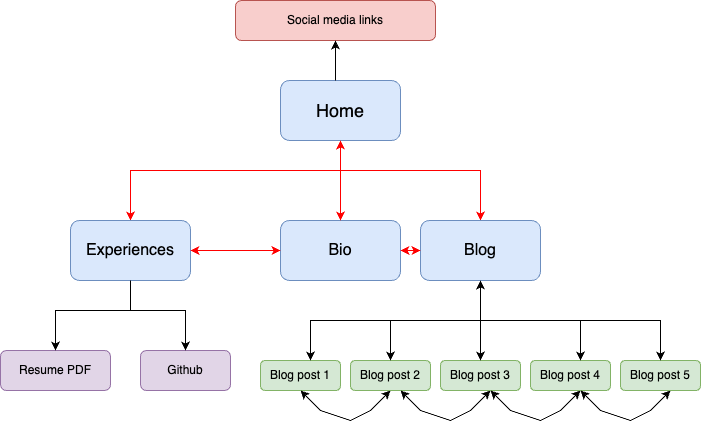

* There is a *logo* on the top right corner of every webpage that links to 'Home' (index.html)
* The *navigation bar* on the top left corner of every webpage leads to each of the blue boxes

## Wireframes

Home Page
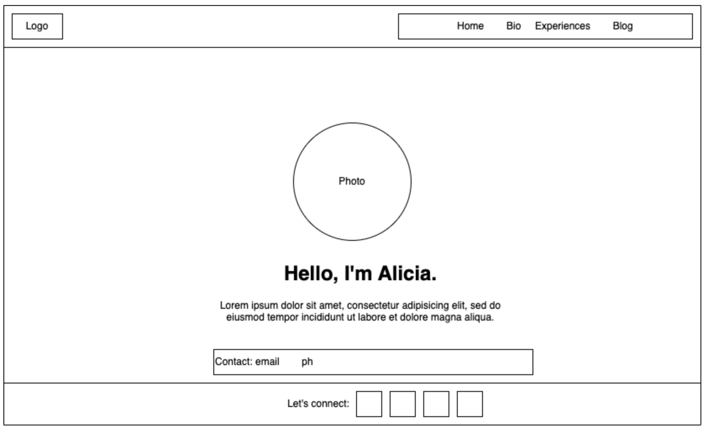
Bio
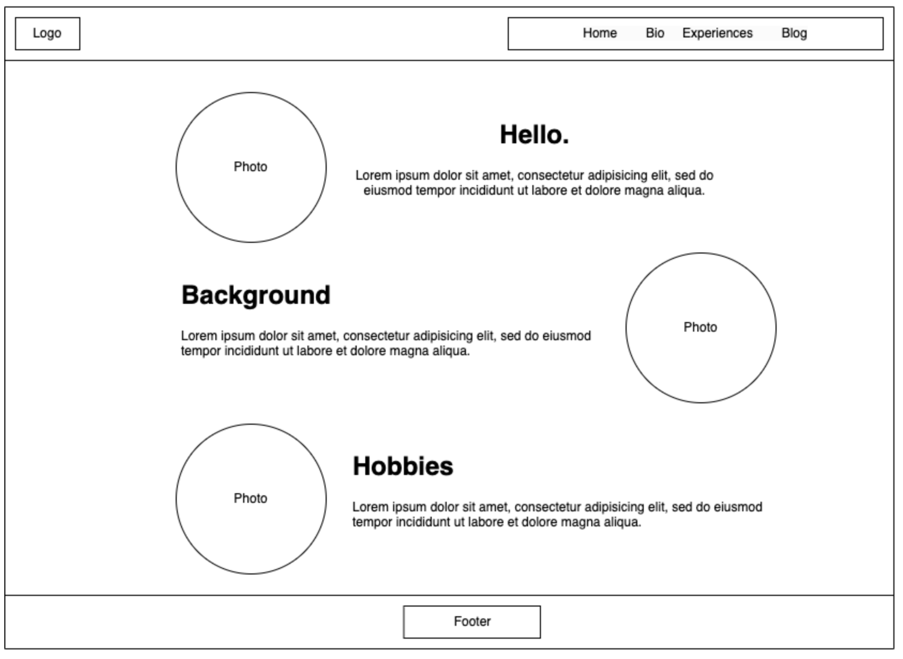
Experiences
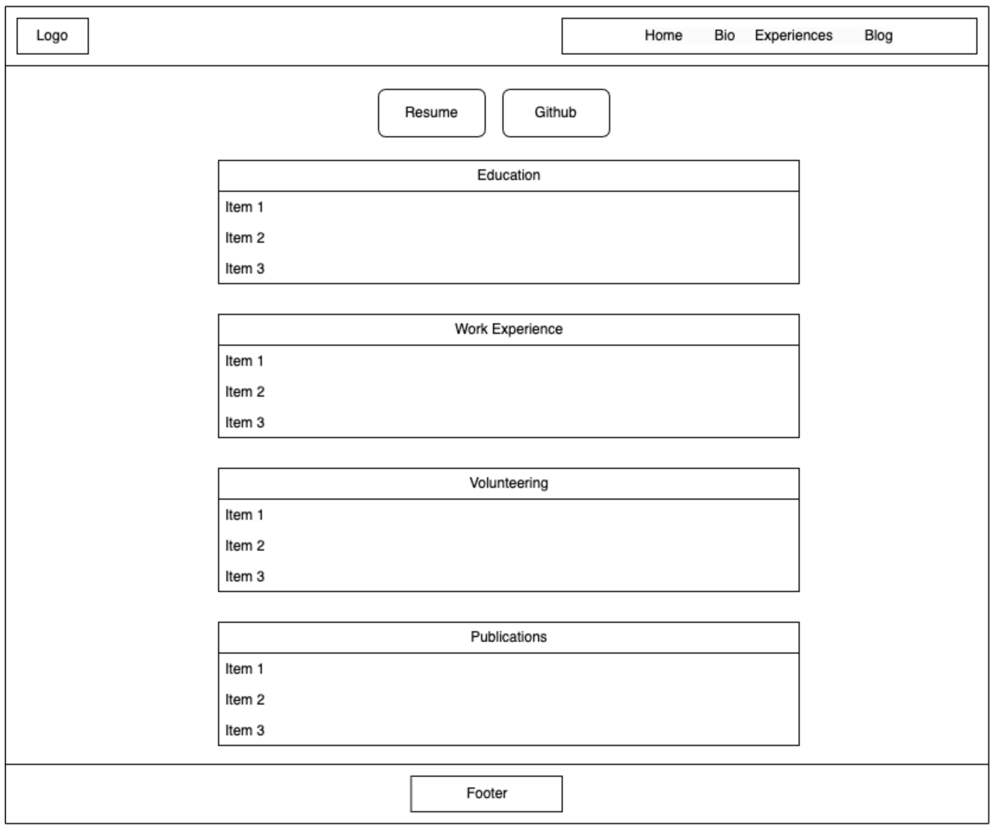
Blog
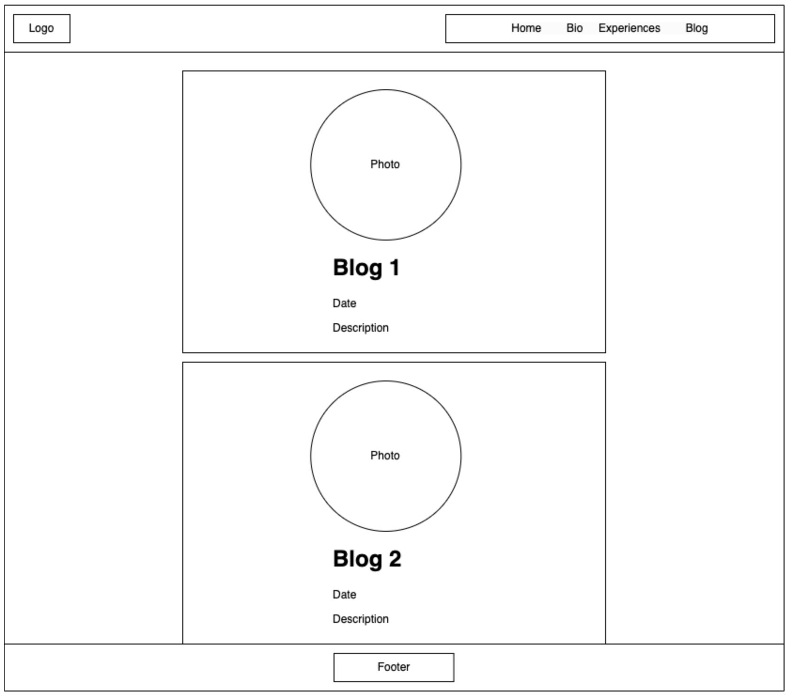
Sample Blog Post
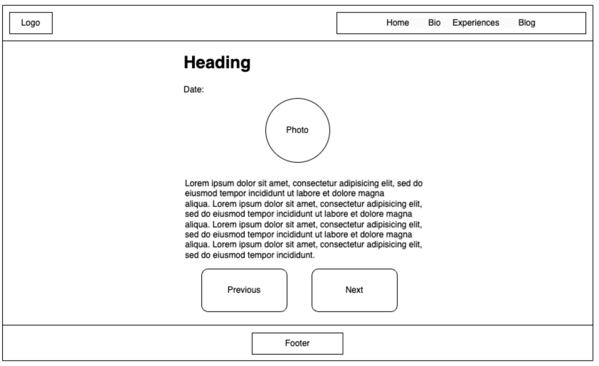

## Screenshots

**Please note that the background image will stay and cover the whole viewport with scrolling**:

### Home Page

Mobile:
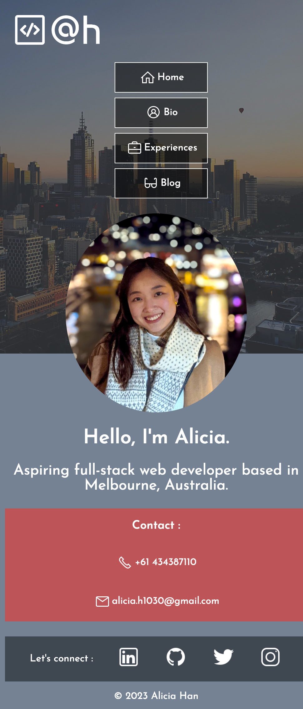
Tablet:
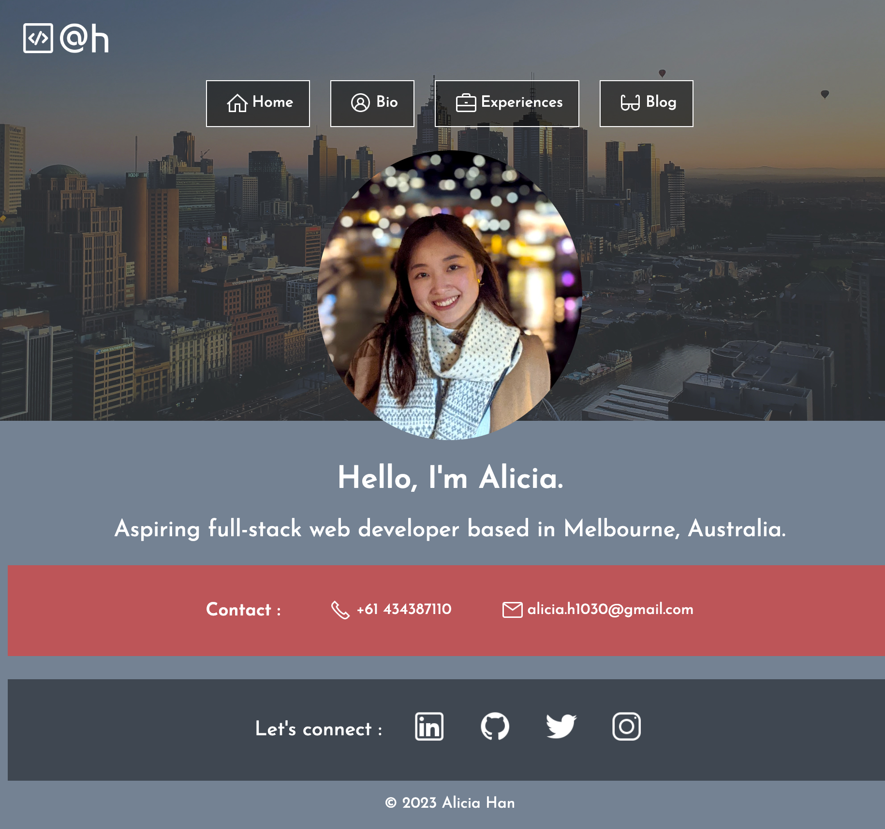
Desktop:

### Bio

Mobile:
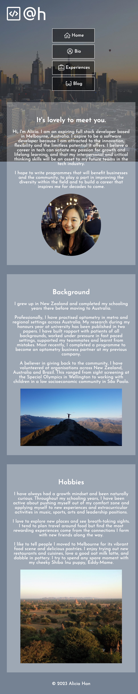
Tablet:

Desktop:

### Experiences

Mobile:
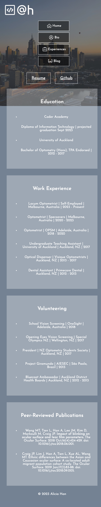
Tablet:
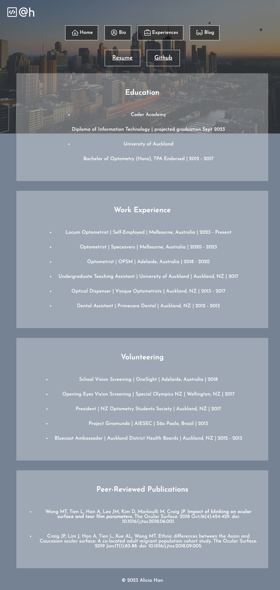
Desktop:

### Blog

Mobile:
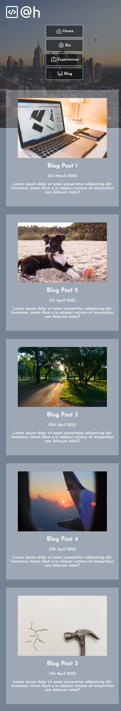
Tablet:

Desktop:

### Sample Blog Post

Mobile:
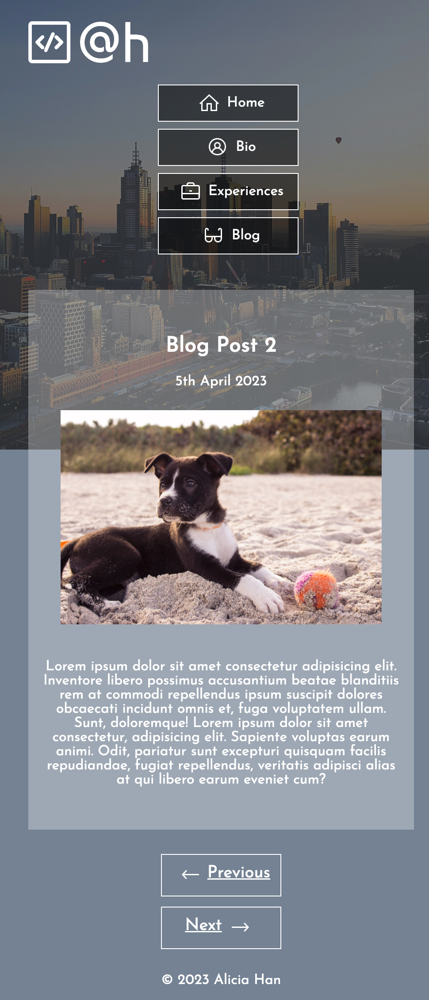
Tablet:
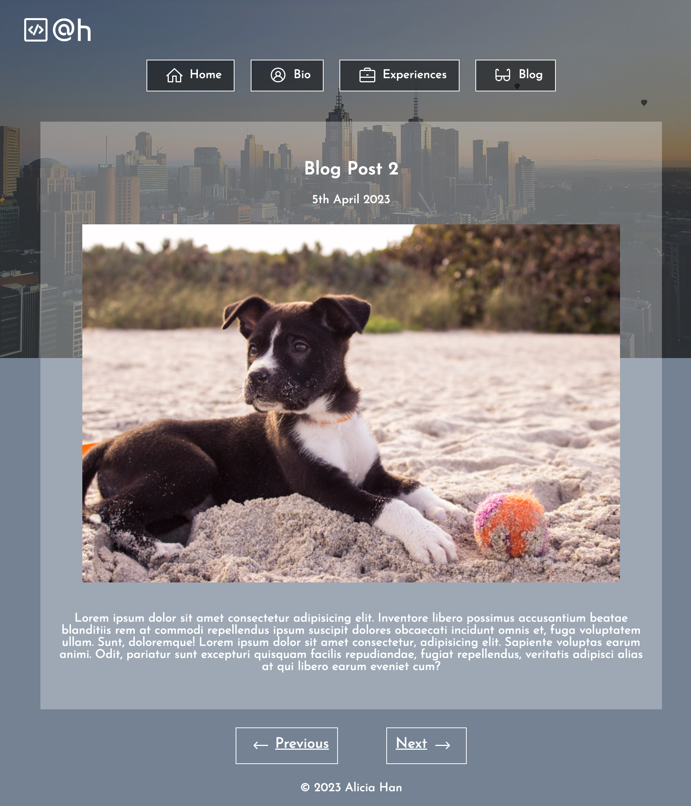
Desktop:

## Target Audience

Employers and recruiters with sound IT knowledge, looking to hire a professional developer with a positive attitude and good technical skills. They are familiar with programming languages and software development.

## Tech Stack

* Wireframes and Sitemap: [draw.io](https://app.diagrams.net/)
* Website: Semantic HTML and CSS
* Image optimisation: [Image Optimizer](http://www.imageoptimizer.net/Home.aspx) and Preview
* Logo: [LOGO.com](https://logo.com/)
* Deployment: [Vercel](https://vercel.com/)
* Resume creation: [Canva](https://www.canva.com/)
* Slide deck: Powerpoint